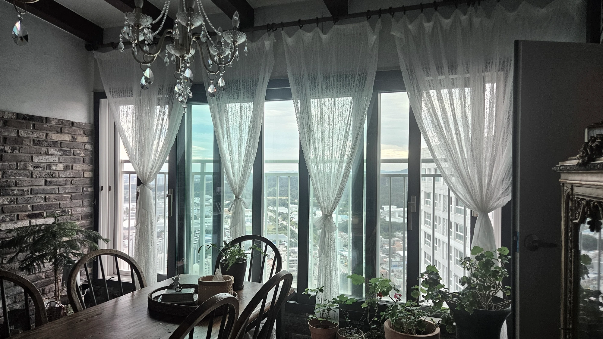

이중커튼의 가장 큰 장점은 **낮과 밤에 다르게 쓸 수 있다**는 점이에요.

낮에는 쉬폰만 쳐서 햇빛은 들이고 바깥 시선은 부드럽게 가립니다. 밤에는 암막까지 쳐서 빛과 시선을 가려요. 차단 정도는 원단과 커튼 가장자리의 틈에 따라 달라집니다. 커튼 하나로는 어려운 두 가지를 함께 해결하는 구성입니다.

---

## 이중커튼이란?

커튼 레일을 두 줄로 설치하고, **쉬폰커튼과 암막커튼을 한 겹씩** 거는 방식이에요.

| 구분 | 쉬폰커튼 | 암막커튼 |
|---|---|---|
| 원단 | 얇고 가벼움 | 두껍고 빛을 막음 |
| 주로 쓰는 시간 | 낮 | 밤, 낮잠, 숙면 |
| 역할 | 채광 + 부드러운 시선 차단 | 빛 차단 + 확실한 사생활 보호 |

두 커튼은 따로 열고 닫을 수 있어요. 상황에 따라 쉬폰만, 암막만, 둘 다 쓰는 식으로 조절합니다.

---

## 이중커튼의 장점 3가지

### 1. 낮·밤 채광을 따로 조절할 수 있어요

"빛은 들어오는데 안 비쳤으면 좋겠어요"는 낮의 고민이에요. 쉬폰으로 빛을 부드럽게 조절할 수 있어요. 다만 낮에도 원단의 비침과 실내외 밝기에 따라 안이 보일 수 있습니다.
"아침 햇빛 때문에 일찍 깨요"는 밤과 새벽의 고민이에요. 암막이 해결합니다.

### 2. 밤 사생활 보호가 확실해져요

쉬폰은 얇은 원단이라, 밤에 실내 조명을 켜면 바깥에서 안이 비쳐 보일 수 있어요.
이때 암막을 함께 치면 시선을 확실히 막을 수 있습니다. 저층 세대라면 특히 도움이 돼요.

### 3. 답답하지 않으면서 빛은 막을 수 있어요

"암막은 필요한데 집이 너무 답답해 보이는 건 싫어요"라는 고민이 많아요.
이중커튼은 낮에 암막을 열어 두고 쉬폰만 쓰면 되기 때문에, 암막 단독보다 낮 시간이 훨씬 밝습니다.

---

## 이중커튼 전에 확인할 점

**1. 레일 두 줄이 들어갈 공간이 있는지**
커튼박스(천장에 커튼 레일을 숨기는 홈) 폭이 좁으면 레일 두 줄이 들어가지 않을 수 있어요. 방문 실측 때 확인해 드립니다. 설치 가능한 구성은 현장 조건을 확인한 뒤 안내해 드려요.

**2. 비용이 단일 커튼보다 올라가요**
원단과 레일이 두 겹으로 들어가기 때문이에요. 거실은 이중커튼, 다른 방은 단일 커튼처럼 공간별로 나누면 비용을 조절할 수 있어요.

**3. 커튼을 열었을 때 모이는 부피가 커져요**
두 겹이 양옆으로 모이기 때문에 단일 커튼보다 자리를 더 차지해요. 창 옆 가구 배치가 있다면 실측 때 함께 봐 드려요.

---

## 이중커튼이 잘 맞는 집

| 이런 집이라면 | 이유 |
|---|---|
| 거실 창이 넓은 집 | 낮 채광과 밤 차단을 모두 챙길 수 있음 |
| 햇빛이 강하게 드는 창 | 낮에는 쉬폰으로 부드럽게, 필요할 땐 암막으로 차단 |
| 저층 세대 | 밤 시간 사생활 보호 |
| 거실에서 아이가 낮잠을 자는 집 | 낮에도 암막으로 어둡게 만들 수 있음 |

**작은 방이나 주방처럼 공간이 좁은 곳**은 이중커튼보다 블라인드가 더 잘 맞을 수 있어요. → [커튼 vs 블라인드, 우리 집엔 뭐가 맞을까요?](/블로그/curtain-vs-blind)

---

## 원단 조합은 실측 때 함께 정해요

쉬폰과 암막은 원단 종류가 다양해요. 비침 정도, 두께감, 색감에 따라 같은 이중커튼이라도 느낌이 달라집니다.

본대로홈은 이렇게 도와드려요.

1. **매장에서 원단 직접 확인** — 쉬폰과 암막 원단을 겹쳐 보며 비교할 수 있어요.
2. **방문 실측 때 현장 조율** — 창 방향, 햇빛 드는 시간, 벽지·가구 색감을 보고 조합을 함께 정합니다.

오창·청주·오송 지역은 방문 실측이 무료예요.

## 낮에는 밝게, 밤에는 편안하게

우리 집 거실에 이중커튼이 맞을지 궁금하시다면, 전화로 편하게 물어보세요.

[지금 전화 상담하기](tel:050-6686-4878) · [매장에서 원단 직접 보기](/문의)

함께 보면 좋은 글과 페이지도 확인해 보세요.

- [커튼·블라인드 종류와 선택 가이드](/서비스)
- [커튼 vs 블라인드, 우리 집엔 뭐가 맞을까요?](/블로그/curtain-vs-blind)
- [30평 아파트 거실 커튼 비용은 무엇에 따라 달라질까요?](/블로그/living-room-curtain-cost-factors)
