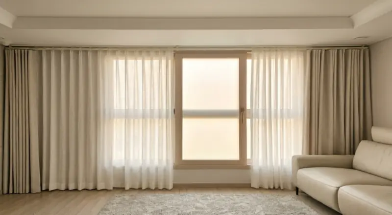
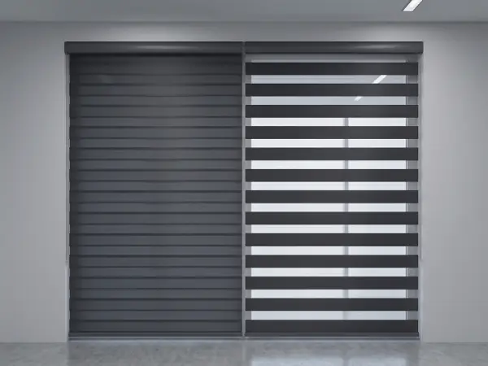
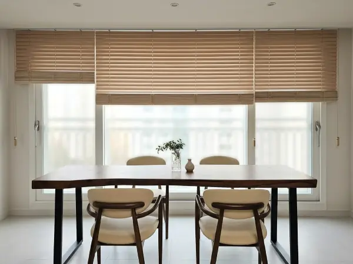

## "거실은 커튼, 주방은 블라인드" 맞는 말일까요

상담 전화를 받으면 가장 많이 듣는 질문이 이겁니다.

"저희 집은 커튼이 나을까요, 블라인드가 나을까요?"

인터넷을 찾아보면 거실은 커튼, 주방은 블라인드라는 얘기가 많습니다. 크게 틀린 말은 아닙니다. 다만 12년 동안 청주와 오창 집들을 다니면서 느낀 건, **같은 거실이어도 집마다 답이 다르다**는 겁니다.

창 크기, 창이 바라보는 방향, 앞 건물과의 거리, 집에 아이가 있는지, 결로가 생기는 창인지. 이런 것들이 겹치면서 답이 달라집니다.

그래서 이 글에서는 "무조건 이게 좋다" 대신, **실측하러 가서 제가 실제로 여쭤보는 것들**을 정리해 보려고 합니다. 읽어 보시고 우리 집은 어느 쪽에 가까운지 가늠해 보시면 좋겠습니다.

## 먼저, 둘의 성격이 다릅니다

기능을 따지기 전에 성격 차이를 아시면 판단이 쉬워집니다.

**커튼은 원단입니다.** 천이 주름을 잡고 늘어지면서 공간을 부드럽게 만듭니다. 면적이 넓어서 색이 공간 분위기를 크게 좌우하고, 공기층을 만들어 주기 때문에 겨울철 단열에도 도움이 됩니다. 대신 자리를 차지합니다. 창 양옆으로 원단이 모이니까요.

**블라인드는 구조물입니다.** 날개나 슬랫의 각도로 빛을 조절합니다. 창에 딱 붙어 있어서 자리를 거의 차지하지 않고, 빛을 얼마나 들일지 단계적으로 정할 수 있습니다. 대신 원단만큼의 포근함은 없습니다.

한 줄로 줄이면 이렇습니다. **분위기와 단열이 중요하면 커튼, 공간 절약과 빛 조절이 중요하면 블라인드.**

여기서부터 공간별로 들어가 보겠습니다.

## 거실 — 창이 크고 바닥까지 내려온다면 커튼

거실은 집에서 창이 가장 큰 공간입니다. 면적이 넓은 만큼 여기에 무엇을 다느냐가 집 전체 인상을 정합니다.

바닥까지 내려오는 큰 창이라면 커튼을 권해 드리는 편입니다. 원단이 길게 떨어지면서 생기는 주름이 공간을 정돈해 주고, 겨울에 창에서 들어오는 냉기를 한 겹 막아 줍니다. 오창 쪽 아파트는 거실 창이 크고 베란다를 확장한 집이 많아서, 단열 얘기를 꺼내시는 분이 특히 많습니다.

거실 커튼은 **이중커튼**으로 많이 하십니다. 속커튼(시어커튼)과 겉커튼을 겹쳐 다는 방식인데, 낮에는 속커튼만 쳐서 빛은 들이고 시선은 가리고, 밤이나 잘 때는 겉커튼까지 치는 식으로 씁니다. 하루 종일 쓰는 공간이라 이 두 단계가 꽤 요긴합니다.

다만 거실에도 블라인드를 권해 드리는 경우가 있습니다.

- **창밖 전망이 좋은 집** — 원단으로 가리기 아까운 뷰가 있으면 블라인드로 시야를 살립니다
- **아이가 어린 집** — 원단이 바닥에 끌리는 게 신경 쓰이신다면 블라인드가 관리가 쉽습니다
- **거실이 좁은 집** — 커튼이 양옆으로 차지하는 폭이 부담스러운 구조가 있습니다

## 주방 — 물과 기름을 먼저 생각하세요

주방은 취향보다 **관리**가 먼저입니다.

요리할 때 기름이 튀고 물이 닿습니다. 원단은 여기서 불리합니다. 기름때가 배면 세탁해도 잘 안 빠지고, 자주 떼어 빠는 것도 일이거든요.

그래서 주방 창에는 블라인드를 권해 드립니다. 그중에서도 **콤비블라인드**를 많이 하십니다. 원단이 두 겹으로 겹쳐 있어서 위아래로 밀면 빛이 들어오는 정도가 달라지는 제품입니다.

설거지할 때는 빛을 들이고, 햇빛이 강할 때는 맞춰서 가리고. 이런 조절이 주방에서는 생각보다 자주 필요합니다.

주방 창이 작다면 **롤스크린**도 좋습니다. 구조가 단순해서 가격이 부담이 덜하고, 닦기도 쉽습니다.

## 침실 — 아침에 몇 시에 깨고 싶으신가요

침실에서는 이 질문 하나로 거의 정리됩니다.

**"아침 햇빛에 깨는 게 괜찮으세요, 아니면 어두운 게 좋으세요?"**

어두운 게 좋다고 하시면 **암막커튼**입니다. 빛을 거의 다 막아 주기 때문에 늦게까지 주무셔야 하는 분, 교대 근무로 낮에 주무시는 분께는 이것 말고 대안이 마땅치 않습니다. 아이 방도 낮잠 때문에 암막으로 하시는 경우가 많습니다.

햇빛에 자연스럽게 깨는 게 좋다고 하시면 굳이 암막까지 갈 필요는 없습니다. 일반 커튼이나 블라인드로도 충분합니다.

한 가지 짚어 드릴 게 있습니다. 암막커튼을 달아도 **커튼 가장자리로 빛이 새면 효과가 반감됩니다.** 창보다 넉넉하게 제작하고 레일 위치를 잘 잡아야 하는데, 이 부분은 실측 때 같이 봐 드리고 있습니다.

## 서재·작업실 — 눈부심을 잡는 게 핵심

모니터를 보는 공간이라면 기준이 하나 더 생깁니다. **화면에 빛이 반사되지 않아야** 합니다.

이때는 각도 조절이 되는 블라인드가 유리합니다. 빛이 들어오는 방향에 맞춰 슬랫을 기울이면, 방은 밝은데 화면에는 반사가 없는 상태를 만들 수 있습니다. 커튼은 열거나 닫거나 둘 중 하나라 이 조절이 어렵습니다.

**우드블라인드**는 여기에 더해 나무 질감이 있어서, 책상이나 식탁이 있는 공간과 잘 어울립니다.

## 욕실·현관 — 물기와 크기를 보세요

욕실 창은 작고 물기가 많습니다. 원단은 피하시는 게 좋습니다. 습기를 머금으면 곰팡이가 생기기 쉽습니다.

이런 창에는 **알루미늄블라인드**나 물에 강한 소재의 롤스크린이 맞습니다. 창이 작아서 비용 부담도 크지 않습니다.

현관 옆 작은 창도 마찬가지입니다. 크기가 작으니 구조가 단순한 제품으로 가는 편이 깔끔합니다.

## 섞어 쓰셔도 됩니다

"집 전체를 통일해야 하나요?"

아닙니다. 오히려 공간 성격에 따라 나누는 게 자연스럽습니다. 거실은 커튼, 주방과 욕실은 블라인드, 침실은 암막커튼. 이렇게 섞는 집이 많고 전혀 어색하지 않습니다.

대신 한 가지만 지키시면 좋습니다. **색 계열을 하나로 맞추세요.** 제품 종류는 달라도 톤이 이어지면 집 전체가 정돈되어 보입니다. 거실 커튼이 아이보리면 주방 블라인드도 밝은 베이지 계열로 가는 식입니다.

## 전화로 미리 여쭤보는 것들

실측 약속을 잡기 전에 전화로 이런 걸 여쭤봅니다. 미리 생각해 두시면 상담이 빨라집니다.

- **어느 공간에 하실 건가요** — 거실만인지, 집 전체인지
- **창이 몇 개이고 대략 어느 정도 크기인가요** — 정확하지 않아도 됩니다
- **앞 건물이 가까운가요** — 사생활 보호가 얼마나 급한지 판단합니다
- **겨울에 결로가 생기는 창이 있나요** — 원단을 쓸 수 있는지가 갈립니다
- **생각하시는 예산이 있으신가요** — 그 안에서 맞출 수 있는 구성을 찾아드립니다

마지막 항목을 부담스러워하시는 분이 많은데, 말씀해 주시는 편이 서로 좋습니다. 예산을 알면 그 안에서 가장 나은 조합을 찾아드릴 수 있고, 괜히 안 맞는 제품을 보시느라 시간 쓰실 일도 없습니다.

## 그래도 헷갈리시면

여기까지 읽으셔도 애매한 집이 있습니다. 당연합니다. 창을 직접 보지 않고 글로만 정하는 데는 한계가 있으니까요.

그럴 때는 전화 주세요. 창 사진 한 장만 보내 주셔도 대략적인 방향은 말씀드릴 수 있습니다. 청주·오창·오송 지역은 **방문 실측이 무료**이니, 부담 없이 불러 주셔도 됩니다.

매장에 오시면 원단을 직접 만져 보실 수도 있습니다. 화면으로 보는 색과 실제 원단 색은 꽤 다릅니다. 특히 커튼은 면적이 넓어서 그 차이가 더 크게 느껴지니, 결정 전에 한 번 들러 보시길 권해 드립니다.
