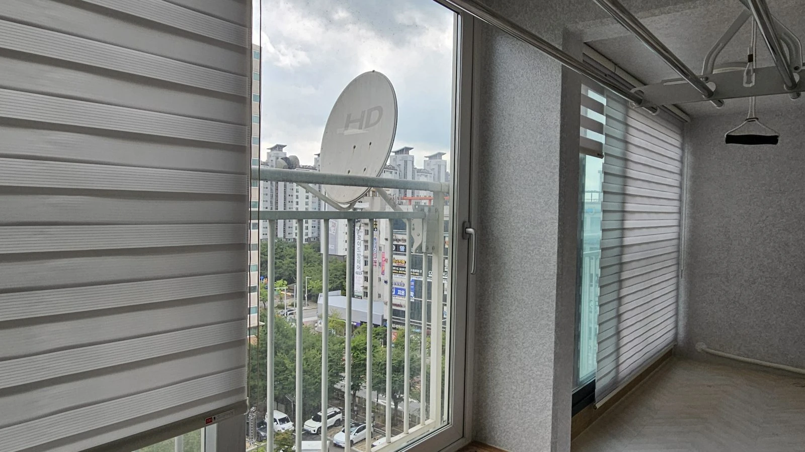
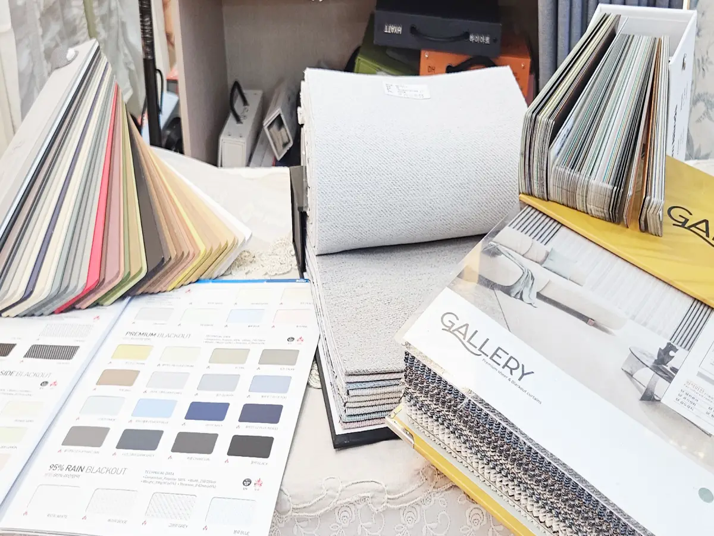

**넓은 창과 침실은 커튼, 빛을 세밀하게 조절해야 하거나 공간이 좁은 곳은 블라인드**가 잘 맞아요.

한 집 안에서도 공간마다 필요한 기능이 다르기 때문에, 거실은 커튼·작은 방과 주방은 블라인드처럼 공간별로 나눠 고르시는 경우가 많습니다.

---

## 한눈에 비교하기

| 비교 항목 | 커튼 | 블라인드 |
|---|---|---|
| 빛 조절 | 열고 닫는 방식. 암막 원단으로 빛 차단 | 슬랫 각도·원단 간격으로 조절 |
| 사생활 보호 | 원단 선택으로 해결 (암막, 이중커튼) | 각도 조절로 빛은 들이고 시선은 차단 |
| 외풍 차단 | 도톰한 원단이 창 전체를 덮어 유리 | 상대적으로 약함 |
| 공간 활용 | 양옆에 커튼이 모이는 자리가 필요 | 창 가까이 설치해 공간을 적게 차지함 |
| 잘 맞는 공간 | 거실, 안방, 아이방 | 작은 방, 주방, 욕실, 사무실 |

---

## 커튼이 잘 맞는 경우

**이런 고민이 있다면 커튼을 추천해요.**

- "숙면을 위해 빛을 확실히 막고 싶어요" → **암막커튼**
- "낮에는 햇빛이 은은하게 들어왔으면 좋겠어요" → **쉬폰커튼**
- "암막은 필요한데 집이 너무 답답해 보이는 건 싫어요" → **암막+쉬폰 이중커튼**
- "외풍 좀 막아주는 도톰한 걸 찾고 있어요" → **두께감 있는 원단의 커튼**

이중커튼은 낮에는 쉬폰만 쳐서 채광을 살리고, 밤에는 암막까지 쳐서 빛을 막는 방식이에요. 낮과 밤의 채광을 다르게 조절하고 싶은 거실에서 고려할 수 있는 구성이에요.

---

## 블라인드가 잘 맞는 경우

**블라인드는 종류별로 잘 맞는 공간이 달라요.**

| 종류 | 특징 | 추천 공간 |
|---|---|---|
| 콤비블라인드 | 두 겹 원단이 교차하며 빛을 세밀하게 조절 | 작은 방, 서재, 사무실 |
| 우드블라인드 | 나무 소재로 원목 가구와 잘 어울림 | 서재, 안방 |
| 롤스크린 | 위로 말아 올리는 방식. 공간 절약 | 주방, 작은 창 |
| 알루미늄블라인드 | 물기·습기에 강하고 관리가 쉬움 | 주방, 욕실 |

"빛은 들어오는데 안 비쳤으면 좋겠어요"라는 고민에는 콤비블라인드가 잘 맞아요. 날개 대신 원단 간격으로 빛과 시선을 함께 조절할 수 있습니다. 다만 비침은 원단과 실내외 밝기에 따라 달라지므로 사생활 보호가 중요하면 비침 정도를 함께 확인해야 해요.

---

## 공간별 추천 정리

| 공간 | 추천 | 이유 |
|---|---|---|
| 거실 | 암막+쉬폰 이중커튼 | 낮·밤 채광 조절, 넓은 창 |
| 안방 | 암막커튼 | 숙면 |
| 아이방 | 암막커튼 또는 콤비블라인드 | 낮잠 시 빛 차단 |
| 작은 방·서재 | 콤비블라인드, 우드블라인드 | 공간 절약, 세밀한 빛 조절 |
| 주방 | 롤스크린, 알루미늄블라인드 | 공간 절약, 관리 쉬움 |
| 욕실 | 알루미늄블라인드 | 습기에 강함 |

공간별 추천은 일반적인 선택 기준이에요. 실제 제품은 창 크기, 햇빛, 습기와 사생활 보호 조건을 확인한 뒤 함께 정해 드립니다.

---

## 그래도 고민된다면, 실측 때 함께 정하세요

카탈로그 사진만으로는 고르기 어려워요.
"사진으로 보는 거랑 실제로 보는 거랑 다를 것 같다"는 걱정도 많이 하십니다.

본대로홈은 두 가지 방법으로 결정을 도와드려요.

1. **매장에서 원단 직접 확인** — 커튼 원단과 블라인드 샘플을 손으로 만져보고 비교할 수 있어요.
2. **방문 실측 때 현장 조율** — 창 방향, 햇빛 드는 시간, 인테리어 색감을 보고 공간별로 함께 정합니다.

오창·청주·오송 지역은 방문 실측이 무료예요.

## 우리 집 공간별로 뭐가 맞을지 고민되신다면

전화로 편하게 물어보세요. 창 크기와 공간을 말씀해 주시면 함께 고민해 드릴게요.

[지금 전화 상담하기](tel:050-6686-4878) · [매장에서 원단 직접 보기](/문의)

함께 보면 좋은 글과 페이지도 확인해 보세요.

- [커튼·블라인드 종류와 선택 가이드](/서비스)
- [30평 아파트 거실 커튼 비용은 무엇에 따라 달라질까요?](/블로그/living-room-curtain-cost-factors)
- [오창 아파트 입주 전, 커튼은 언제 주문해야 할까요?](/블로그/when-to-order-curtains-before-move-in)
- [저층 빌라 사생활 보호를 위한 버티컬블라인드 시공사례](/블로그/ochang-vertical-blind-privacy)
