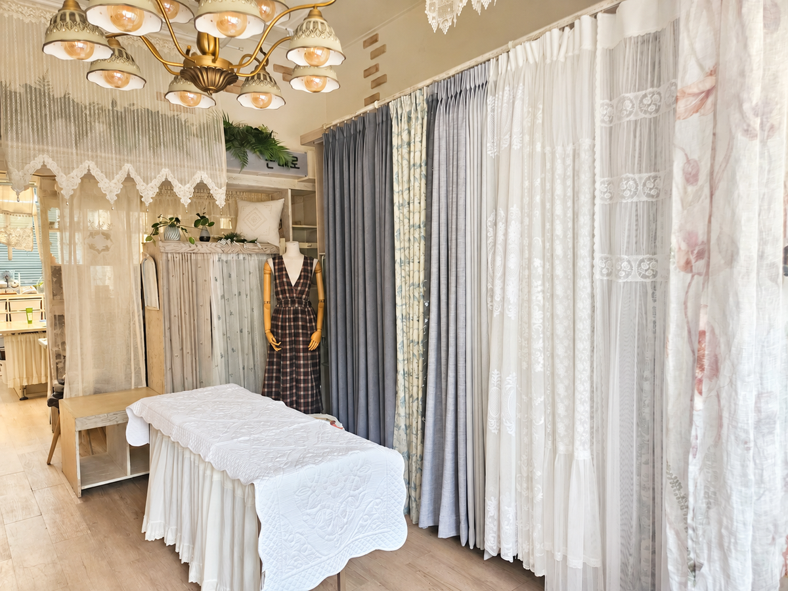

거실 커튼 비용은 **창 크기, 원단, 주름 양, 형상기억 가공, 설치 조건** 다섯 가지에 따라 달라져요.

같은 30평 아파트라도 창 크기와 고르는 원단이 다르면 가격이 달라집니다. 그래서 정확한 금액은 방문 실측 후에 확정돼요.

---

## "거실 커튼 얼마예요?"에 바로 답하기 어려운 이유

커튼 상담에서 가장 많이 듣는 질문이에요.
그런데 맞춤 커튼은 기성품처럼 정해진 가격이 없습니다.

- 거실 창의 가로·세로 길이가 집마다 달라요.
- 원단 종류에 따라 단가가 달라요.
- 주름을 얼마나 풍성하게 잡느냐에 따라 원단 사용량이 달라져요.

전화 상담에서는 고객님이 원하시는 원단과 공간을 듣고 대략적인 범위를 안내해 드려요. 정확한 금액은 실측 후에 알려드립니다.

---

## 커튼 비용을 결정하는 5가지 요소

### 1. 창 크기

커튼 비용의 기본은 **원단을 얼마나 쓰느냐**예요.
거실 창이 넓고 천장이 높을수록 원단이 많이 들어갑니다.

### 2. 원단 종류

| 원단 | 특징 |
|---|---|
| 암막 원단 | 빛 차단, 숙면, 사생활 보호 |
| 쉬폰 원단 | 자연 채광, 얇고 가벼움 |
| 암막+쉬폰 이중 | 두 겹을 함께 다는 구성. 낮·밤 채광 조절 |

이중커튼은 원단과 레일이 두 겹으로 들어가기 때문에 단일 커튼보다 비용이 올라가요.

### 3. 주름 양

주름이 풍성할수록 원단이 더 들어가요.
"차르르 떨어지는 느낌"을 원하신다면 주름 양이 중요합니다. 실측 때 창 크기와 원하시는 분위기를 함께 보고 적정한 주름 양을 정해 드려요.

### 4. 형상기억 가공

형상기억은 커튼 주름이 일정한 모양으로 유지되도록 하는 가공이에요.
주름이 흐트러지지 않아 정돈된 모습이 오래가지만, 가공 비용이 추가됩니다.

### 5. 설치 조건

- 레일 종류와 설치 위치 (천장 또는 벽)
- 설치비 포함 여부
- 레일 비용 포함 여부

견적을 비교하실 때는 **설치비와 레일이 포함된 금액인지** 꼭 확인하세요. 업체마다 포함 항목이 달라 총액이 다르게 보일 수 있어요.

---

## 실측 후 견적이 달라질 수 있나요?

네, 달라질 수 있어요.
전화 상담 때 안내드리는 금액은 대략적인 범위예요. 실측으로 정확한 창 크기와 설치 조건을 확인한 뒤 최종 견적이 나옵니다.

그래서 본대로홈은 다음 순서로 진행해요.

1. 전화 상담 — 원하시는 원단·공간을 듣고 대략적인 범위 안내
2. 방문 실측 — 정확한 사이즈 측정 + 창 방향·인테리어 색감 조율
3. 최종 견적 — 실측 결과로 정확한 금액 확정
4. 발주 — 고객님이 확정하신 뒤 공장에 주문

오창·청주·오송 지역은 방문 실측이 무료예요.

---

## 본대로홈의 가격 기준

본대로홈은 **공장과 직접 거래**해요.
중간 유통 단계를 거치지 않기 때문에 그만큼의 마진이 가격에 붙지 않습니다.

또 미싱을 직접 보유하고 있어 설치 후 기장 수정 같은 작은 수선은 직접 해드려요. 공장 재발주로 인한 추가 비용과 시간을 줄일 수 있습니다.

---

## 견적 받기 전 체크리스트

견적을 요청하기 전에 아래 내용을 정리해 두시면 상담이 빨라져요.

- [ ] 커튼을 달 공간 (거실만 / 안방·아이방 포함)
- [ ] 원하는 기능 (암막 / 채광 / 사생활 보호 / 외풍 차단)
- [ ] 단일 커튼 또는 암막+쉬폰 이중커튼
- [ ] 형상기억 가공 희망 여부
- [ ] 입주일 또는 설치 희망일

## 우리 집 거실 커튼 비용이 궁금하시다면

전화로 먼저 물어보세요. 원하시는 원단과 공간만 말씀해 주시면 대략적인 범위부터 안내해 드릴게요.

[지금 전화 상담하기](tel:050-6686-4878) · [매장에서 원단 직접 보기](/문의)

함께 보면 좋은 글과 페이지도 확인해 보세요.

- [커튼·블라인드 종류와 선택 가이드](/서비스)
- [오창 아파트 입주 전, 커튼은 언제 주문해야 할까요?](/블로그/when-to-order-curtains-before-move-in)
- [커튼과 블라인드, 우리 집엔 뭐가 맞을까](/블로그/curtain-vs-blind-guide)
