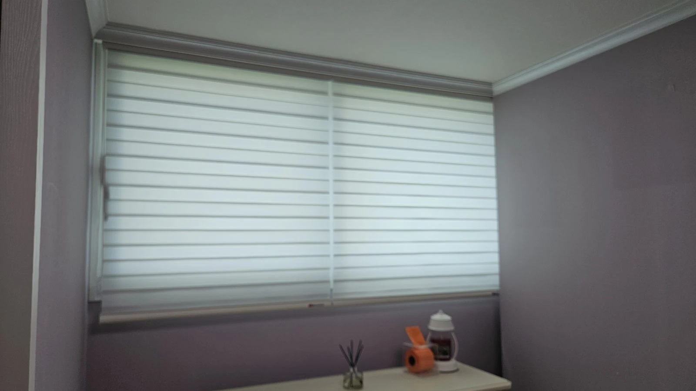
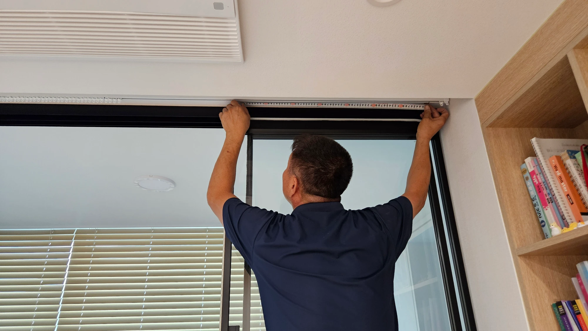
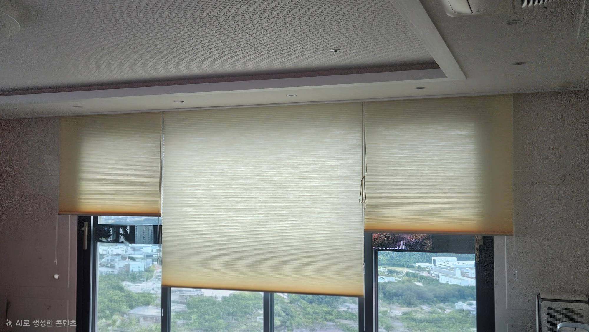

저층 사생활 보호는 **낮과 밤을 나눠서 준비**하셔야 해요.

낮에는 빛을 들이면서 시선만 가리는 제품이, 밤에는 비침이 적은 원단과 틈을 줄이는 설치가 필요합니다. 그래서 저층 세대는 **암막+쉬폰 이중커튼**이나 **콤비블라인드**처럼 시간대별로 조절할 수 있는 구성이 잘 맞아요.

---

## "저층이라 사생활 보호가 제일 중요해요"

저층 세대에서 자주 고민하시는 부분이에요.
저층은 바깥 보행로, 화단, 맞은편 동에서 집 안이 보이기 쉬워요. 커튼을 고를 때 채광보다 시선 차단을 먼저 생각하시게 됩니다.

그런데 시선만 막으려고 하루 종일 암막을 치면 집이 어두워져요. 그래서 **시간대별로 다르게 쓰는 방법**이 중요합니다.

---

## 낮과 밤, 보이는 방향이 달라요

| 시간대 | 상황 | 필요한 것 |
|---|---|---|
| 낮 | 바깥이 실내보다 밝음 → 안이 상대적으로 덜 보임 | 빛은 들이고 시선은 부드럽게 가리는 원단 |
| 밤 | 실내 조명이 켜져 바깥보다 밝음 → 안이 잘 보임 | 시선을 완전히 막는 원단 |

낮에도 원단의 비침, 실내외 밝기와 보는 거리·각도에 따라 안이 보일 수 있어요. 암막도 가장자리 틈이 있으면 시야가 노출될 수 있어 설치 상태를 함께 확인해야 합니다.

밤에는 얇은 원단만 쳐 두면 실내가 비쳐 보일 수 있어요. 낮에 괜찮았던 커튼이 밤에 불안하게 느껴지는 이유입니다.

---

## 저층 세대에 잘 맞는 3가지 구성

### 1. 암막+쉬폰 이중커튼

- 낮: 쉬폰으로 채광을 살리면서 시선 완화
- 밤: 암막까지 쳐서 바깥 시선 차단

거실처럼 창이 넓은 공간에 잘 맞아요. → [암막커튼과 쉬폰커튼, 이중으로 달면 뭐가 좋을까요?](/블로그/blackout-sheer-double-curtain)

### 2. 비침이 적은 쉬폰 원단

쉬폰도 원단에 따라 비치는 정도가 달라요. 저층이라면 일반 쉬폰보다 **안이 덜 비치는 원단**을 고르시면 낮 시간 불안이 줄어요. 원단의 비침 정도와 취급 가능한 제품은 상담 때 확인해 주세요.

### 3. 콤비블라인드

두 겹 원단의 간격을 조절해 빛과 시선을 함께 다룰 수 있어요.
"빛은 들어오는데 안 비쳤으면 좋겠어요"라는 고민에 잘 맞습니다. 작은 방, 아이방처럼 창이 작은 공간에서 고려할 수 있어요. 다만 투명한 부분을 열어 두면 안이 보일 수 있으므로, 사생활 보호가 필요할 때는 비침이 적은 부분으로 가려야 합니다.

---

## 저층일수록 더 꼼꼼히 봐야 할 것

**1. 커튼 폭은 넉넉하게**
커튼 폭이 창보다 좁으면 양옆 틈으로 안이 보여요. 창보다 여유 있게 잡는 것이 좋습니다.

**2. 기장은 바닥 가까이**
저층은 바깥 시선이 아래쪽에서 올라오는 경우가 많아요. 커튼 아래가 많이 뜨면 그 틈으로 보일 수 있습니다.

**3. 바깥 시선이 오는 방향 확인**
보행로, 화단, 맞은편 동 중 어디서 시선이 오는지에 따라 막아야 할 창과 높이가 달라요.

이 세 가지는 창문 사이즈만으로는 판단하기 어려워요. 방문 실측 때 바깥 시야까지 함께 보고 정해 드립니다.

---

## 공간별 추천 (저층 기준)

| 공간 | 추천 | 이유 |
|---|---|---|
| 거실 | 암막+쉬폰 이중커튼 | 넓은 창, 낮·밤 모두 대응 |
| 안방 | 암막커튼 또는 이중커튼 | 밤 시선 차단 + 숙면 |
| 아이방·작은 방 | 콤비블라인드 | 공간 절약, 빛·시선 함께 조절 |
| 주방 | 롤스크린 | 필요할 때만 내려서 시선 차단 |

위 표는 선택 예시예요. 실제 제품은 창 방향, 바깥 시야, 원단의 비침과 생활 방식에 따라 함께 정합니다.

## 밤에도 편하게, 낮에도 밝게

저층 세대 커튼이 고민되신다면, 전화로 편하게 물어보세요.

[지금 전화 상담하기](tel:050-6686-4878) · [매장에서 원단 직접 보기](/문의)

함께 보면 좋은 글과 페이지도 확인해 보세요.

- [암막커튼과 쉬폰커튼, 이중으로 달면 뭐가 좋을까요?](/블로그/blackout-sheer-double-curtain)
- [커튼 vs 블라인드, 우리 집엔 뭐가 맞을까요?](/블로그/curtain-vs-blind)
- [커튼·블라인드 종류와 선택 가이드](/서비스)
