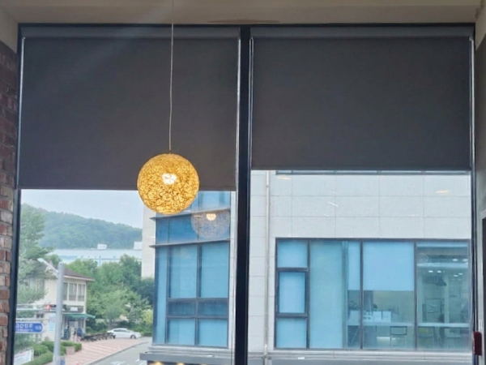
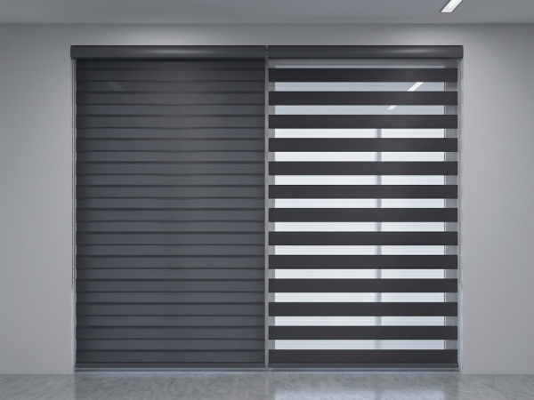
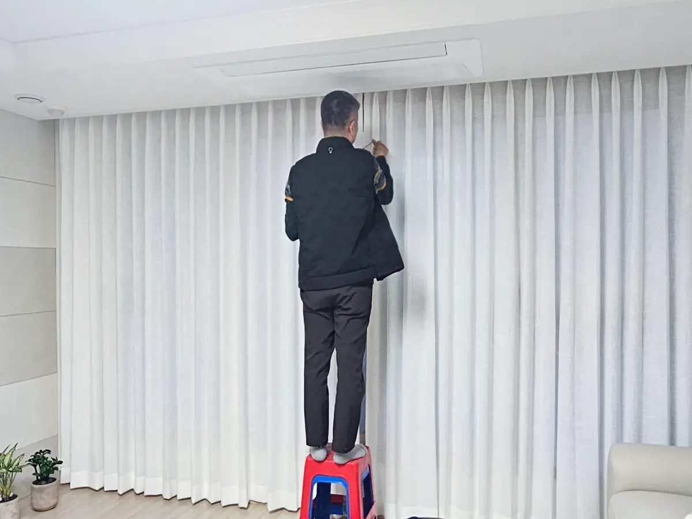
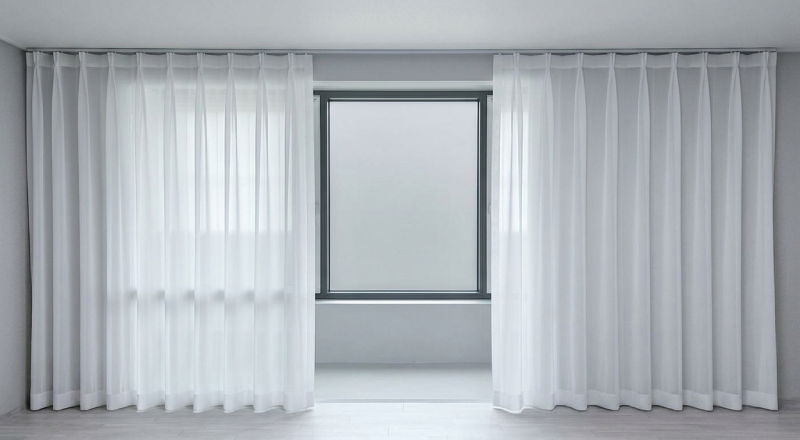
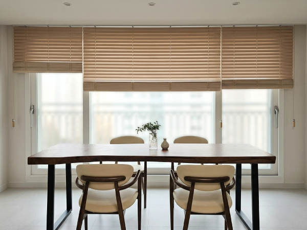

## 이런 고민으로 연락을 주셨어요

며칠 전, 오창 과학단지 근처 양청리 빌라에 다녀왔습니다.

2층이라 괜찮을 줄 알았는데 바로 앞 건물에서 집 안이 훤히 보이는 구조라고 하셨어요. 커튼을 치자니 하루 종일 어둡고, 걷자니 마음이 불편한 상황이었습니다.

가서 보니 기존 롤블라인드가 창보다 작아서, 가장자리로 빛도 시선도 다 새고 있더라고요.

메인 창 옆 수납공간 쪽에도 작은 창이 하나 더 있었는데, 이쪽은 아예 아무것도 없이 그대로 열려 있는 상태였습니다.

## 그래서 버티컬블라인드를 권해 드렸습니다

"밖에서는 안 보이면 좋겠는데, 낮에 빛은 들어왔으면 좋겠어요."

이런 경우에는 버티컬블라인드가 잘 맞습니다. 커튼은 열거나 닫거나 둘 중 하나잖아요. 버티컬은 세로 날개의 각도만 살짝 돌리면, 빛은 은은하게 들어오면서 밖에서는 안이 보이지 않습니다. 이 집 고민에 맞는 제품이지요.

한쪽으로 밀어 모아두면 창이 온전히 열리니 환기하기도 좋습니다. 원룸은 환기가 중요하니까요.

색은 화이트로, 메인 창과 수납공간 창을 같은 제품으로 통일했습니다. 좁은 공간일수록 이렇게 톤을 맞춰야 정돈되어 보입니다.

## 시공 과정

이번 현장은 레일 위치가 관건이었습니다. 천장 몰딩 안쪽에 딱 맞춰 고정해야 블라인드가 벽과 한 몸처럼 떨어지거든요. 몇 mm만 어긋나도 날개가 몰딩에 걸립니다. 그래서 둘이서 수평을 봐 가며 천천히 진행했습니다.

설치를 마치고 날개 각도를 조절해 본 모습이에요. 밖에서는 안이 보이지 않는데, 빛은 이렇게 부드럽게 들어옵니다.

## 완성된 모습

수납공간 쪽 작은 창까지 같은 화이트로 마감하니, 방 전체가 한결 넓고 차분해 보입니다. 고객님도 "이제 마음 놓고 창가에 있겠다"고 하셨어요.

## 비용과 소요 시간

| 항목 | 내용 |
|---|---|
| 시공 범위 | 메인 창 + 수납공간 창 (화이트 버티컬블라인드) |
| 시공 비용 | 20만 원대 |
| 설치 시간 | 약 1시간 |
| 제작 기간 | 주문 후 3일 |
| 실측 | 방문 실측 무료 |

청주 오창·오송 지역은 방문 실측이 무료이고, 당일 상담도 가능합니다.
우리 집 창에는 뭐가 맞을지 고민되시면 편하게 연락 주세요. 같이 보면서 정하면 됩니다.
