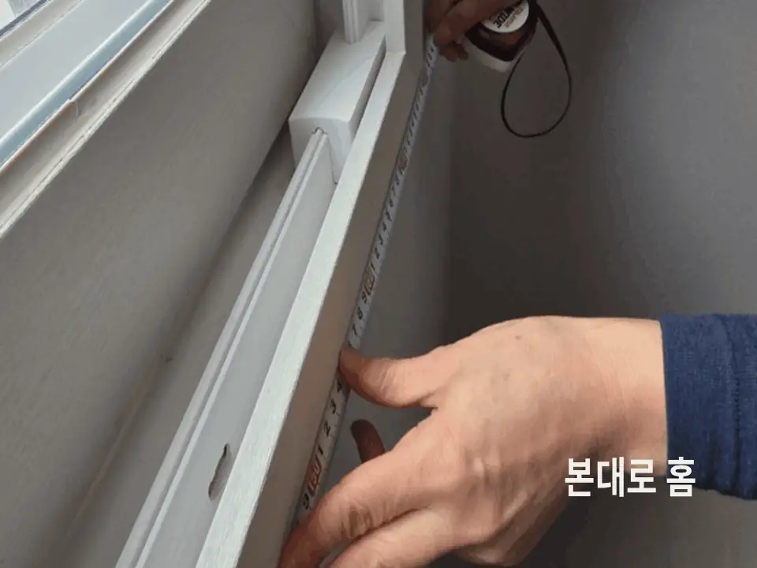
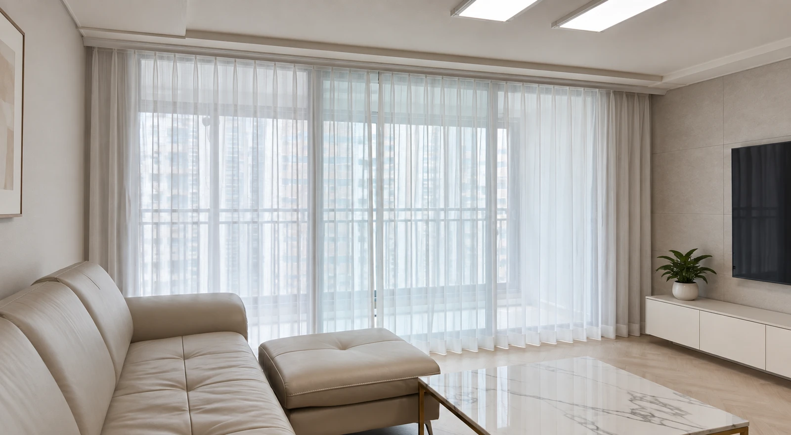

입주일 기준 **최소 2주 전**에는 커튼 상담을 시작하시는 것이 좋아요.

맞춤 커튼은 방문 실측 후 공장에 발주하고, 발주부터 설치까지 **약 1주일**이 걸립니다. 여기에 상담·원단 선택·실측 일정을 더해야 하므로 여유 있게 준비해야 입주 첫날부터 커튼을 사용할 수 있어요.

## 입주 전 커튼 준비, 전체 일정 한눈에 보기

| 단계 | 하는 일 | 소요 기간 |
|---|---|---|
| 1. 상담 | 전화 또는 매장 방문 상담 | 고객님 일정에 따라 |
| 2. 상품 결정 | 매장에서 원단 샘플 확인·상품 선택 | 고객님 일정에 따라 |
| 3. 방문 실측 | 창 크기 측정과 창 방향·인테리어 색감 조율 | 방문 1회 |
| 4. 공장 발주 | 실측 사이즈로 맞춤 제작 주문 | — |
| 5. 설치 | 제작 완료 후 방문 설치 | 발주 후 약 1주일 |

가장 중요한 건 **실측 후 설치까지 약 1주일이 필요하다**는 점이에요. 입주일에서 거꾸로 계산하면 일정을 잡기 쉽습니다.

예를 들어 입주일이 20일이라면, 늦어도 12일 전후에는 실측과 발주가 끝나 있어야 해요. 상담과 원단 선택 시간을 생각하면 그보다 며칠 먼저 문의하시는 편이 안전합니다.

## 왜 미리 주문해야 할까요?

**맞춤 커튼은 재고 제품이 아니에요.**

기성품을 바로 가져가는 방식이 아니라, 고객님 집 창 크기에 맞춰 하나씩 제작합니다. 창 크기와 설치 위치가 확정되어야 제작을 시작할 수 있어요.

**입주 첫날 밤이 가장 불편할 수 있어요.**

커튼이 없으면 밤에는 밖에서 집 안이 보이고, 아침에는 햇빛이 그대로 들어옵니다. 특히 저층이라면 사생활 보호를 먼저 준비하는 것이 좋아요.

**같은 단지의 입주가 한꺼번에 시작되면 일정이 겹칠 수 있어요.**

입주가 몰리는 시기에는 상담과 실측 요청도 함께 늘어납니다. 원하는 날짜에 설치하려면 입주일이 확정되는 대로 먼저 일정을 문의해 주세요.

## 실측은 언제, 어떻게 하나요?

실측은 **창틀과 커튼 레일을 달 위치가 확정된 뒤**에 해야 정확해요.

신축 아파트는 사전점검일이나 입주 전 방문 가능한 날에 실측할 수 있습니다. 단지마다 외부 업체 출입 기준이 다를 수 있으니 관리사무소나 시공사의 안내도 함께 확인해 주세요.

본대로홈은 **오창·청주·오송 지역 방문 실측이 무료**예요. 그 외 지역은 전화로 문의해 주세요.

실측할 때는 다음 항목을 함께 확인합니다.

- 창문 가로·세로 크기
- 창 방향과 햇빛이 드는 시간대
- 벽지·바닥·가구 색감
- 천장 또는 벽의 레일 설치 위치
- 공간별로 필요한 암막·채광·사생활 보호 기능

본대로홈은 창 크기만 재고 돌아오지 않아요. 창 방향과 인테리어까지 고객님과 함께 보고 결정해 설치 후 생각했던 모습과 달라지는 일을 줄입니다.

## 발주 후에는 변경할 수 없나요?

맞춤 제작 특성상 **공장 발주 후에는 취소가 어려워요.**

그래서 본대로홈은 발주 전에 원단 샘플 확인과 현장 실측을 충분히 거칩니다. 고객님이 원단과 색상, 길이를 확인한 뒤에 발주하는 흐름이에요.

설치 후 기장처럼 작은 조정이 필요하다면 걱정하지 않으셔도 돼요. 본대로홈은 미싱을 직접 보유하고 있어 **공장에 다시 보내지 않고 직접 수선**할 수 있습니다.

## 입주 전 커튼 준비 체크리스트

- [ ] 입주일이 확정되었나요?
- [ ] 커튼이 필요한 공간을 정했나요? — 거실, 안방, 아이방, 드레스룸 등
- [ ] 숙면이나 아이방 때문에 암막이 꼭 필요한 방이 있나요?
- [ ] 저층이라 사생활 보호가 우선인가요?
- [ ] 거실은 커튼, 작은 방은 블라인드처럼 공간별로 다르게 설치할 계획인가요?
- [ ] 매장에서 원단을 직접 보고 싶으신가요?

체크한 내용을 전화 상담 때 말씀해 주시면 상담이 훨씬 빨라져요.

## 입주일이 정해졌다면 실측 일정부터 잡아두세요

입주할 집의 창마다 크기와 방향이 다르고, 필요한 기능도 달라요. 본대로홈이 직접 방문해 창과 공간을 함께 보고 알맞은 커튼을 제안해 드립니다.

[지금 전화로 상담하기](tel:050-6686-4878) · [매장 위치와 방문 안내 보기](/문의)

함께 보면 좋은 글과 페이지도 확인해 보세요.

- [상담부터 설치까지 서비스 과정](/서비스과정)
- [커튼 실측과 제작 기간 FAQ](/FAQ)
- [커튼과 블라인드, 우리 집에는 무엇이 맞을까요?](/블로그/curtain-vs-blind-guide)
