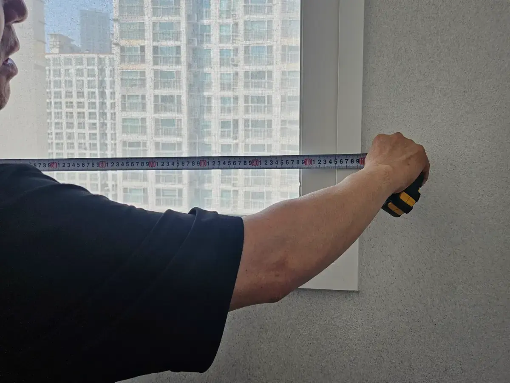

맞춤 커튼이라면 **방문 실측은 꼭 하시는 것이 좋아요.**

맞춤 커튼은 실측한 사이즈로 공장에서 제작하고, 발주 후에는 되돌리기 어려워요. 사이즈가 한 번 어긋나면 다시 맞추는 데 시간과 비용이 듭니다. 실측은 이 실수를 처음부터 막는 단계예요.

---

## "기장 잘못 나와서 두 번 방문했어요"

커튼 후기에서 자주 보이는 이야기예요.
기장(커튼 세로 길이)이 짧으면 바닥 쪽이 떠 보이고, 길면 바닥에 끌립니다. 둘 다 다시 맞춰야 해요.

이런 일이 생기는 이유는 대부분 비슷해요.

- 창 크기만 재고 **레일 달 위치**를 고려하지 않았을 때
- **바닥 높이가 구간마다 조금씩 다른 것**을 확인하지 않았을 때
- 커튼을 거는 **방식(걸이 위치)**에 따라 길이가 달라지는 것을 놓쳤을 때

---

## 직접 재면 왜 실수가 생길까요?

창문 크기를 직접 재는 것 자체는 어렵지 않아요. 문제는 **커튼 사이즈는 창문 사이즈와 다르다**는 점이에요.

| 직접 잴 때 흔한 실수 | 결과 |
|---|---|
| 창틀 안쪽만 잼 | 커튼 폭이 좁아 양옆으로 빛이 샘 |
| 레일 설치 높이를 모름 | 기장이 짧거나 김 |
| 바닥 높이 차이를 확인 안 함 | 한쪽만 끌리거나 떠 보임 |
| 창 옆 가구·에어컨·콘센트 위치를 놓침 | 커튼이 걸리거나 모이는 자리가 부족 |

전문 실측은 창문만 재지 않아요. 커튼이 실제로 걸리고 열리고 모이는 모습까지 계산해서 사이즈를 정합니다.

---

## 본대로홈 실측 때 확인하는 것

본대로홈은 실측 때 **사이즈와 함께 공간 전체**를 봐요.

**사이즈 확인**
- 창문 가로·세로 크기
- 레일 설치 위치 (천장, 커튼박스, 벽)
- 바닥까지의 높이 (여러 지점)
- 창 주변 가구·에어컨·콘센트 위치

**공간 조율**
- 창 방향과 햇빛 드는 시간대
- 벽지·바닥·가구 색감
- 공간별로 필요한 기능 (암막, 채광, 사생활 보호)

실측 현장에서 원단과 구성을 고객님과 함께 최종 결정해요. 그래서 "사진으로 볼 때랑 다르다"는 일을 줄일 수 있습니다.

---

## 기장은 어떻게 정하나요?

커튼 기장은 다음과 같은 마감 방식을 고려할 수 있어요.

| 기장 | 특징 | 잘 맞는 경우 |
|---|---|---|
| 바닥에 살짝 닿지 않게 | 깔끔하고 관리가 쉬움 | 대부분의 거실·방 |
| 바닥에 살짝 닿게 | 빛이 아래로 새는 것을 줄임 | 암막이 중요한 침실 |
| 창틀 아래까지 | 짧고 간결함 | 창 아래에 가구가 있는 경우 |

위 기장은 선택 예시이며, 기본 기장을 일률적으로 정하기보다 현장 조건과 고객님이 원하는 마감을 함께 확인해요.

어떤 기장이 맞을지는 바닥 상태, 커튼 용도, 생활 방식에 따라 달라요. 실측 때 함께 보고 정해 드립니다.

---

## 실측 후에도 안심할 수 있는 이유

**발주 전에 충분히 확인해요.**
맞춤 제작 특성상 공장 발주 후에는 취소가 어려워요. 그래서 실측과 상품 결정을 꼼꼼히 마친 뒤, 고객님이 확정하시면 발주합니다.

**설치 후 기장 수정은 직접 해드려요.**
본대로홈은 미싱을 직접 보유하고 있어요. 작은 기장 조정은 공장에 다시 보내지 않고 직접 수선합니다.

---

## 실측 비용과 지역

**오창·청주·오송 지역은 방문 실측이 무료**예요. 그 외 지역은 전화로 문의해 주세요.

## 커튼은 사이즈가 맞아야 제 역할을 해요

실측 일정이 궁금하시다면, 전화로 먼저 물어보세요.

[지금 전화 상담하기](tel:050-6686-4878) · [매장에서 원단 직접 보기](/문의)

함께 보면 좋은 글과 페이지도 확인해 보세요.

- [상담부터 설치까지 서비스 과정](/서비스과정)
- [오창 아파트 입주 전, 커튼은 언제 주문해야 할까요?](/블로그/when-to-order-curtains-before-move-in)
- [30평 아파트 거실 커튼 비용은 무엇에 따라 달라질까요?](/블로그/living-room-curtain-cost-factors)
